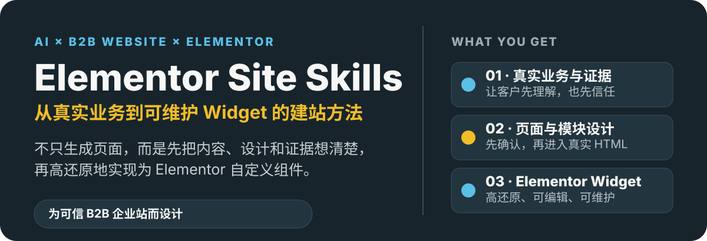
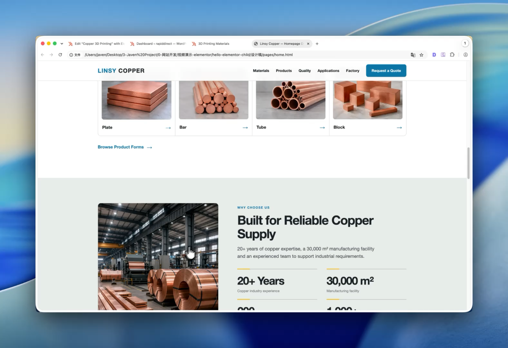
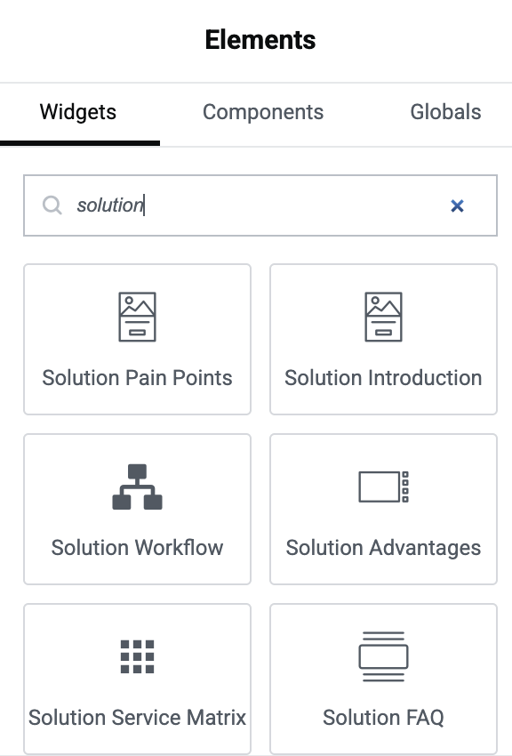
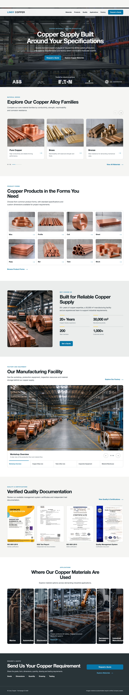
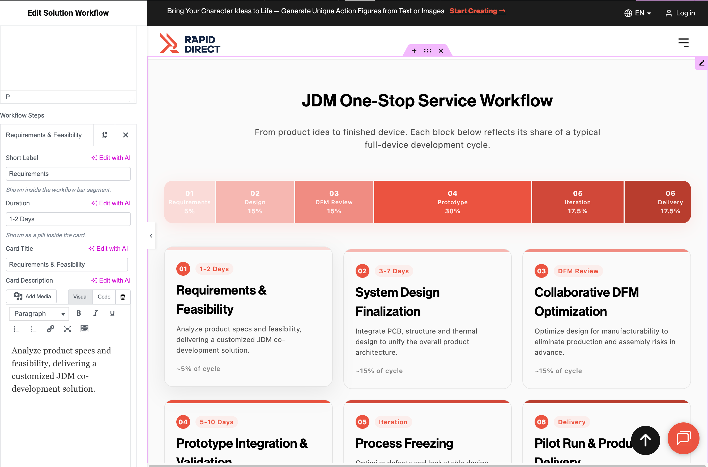
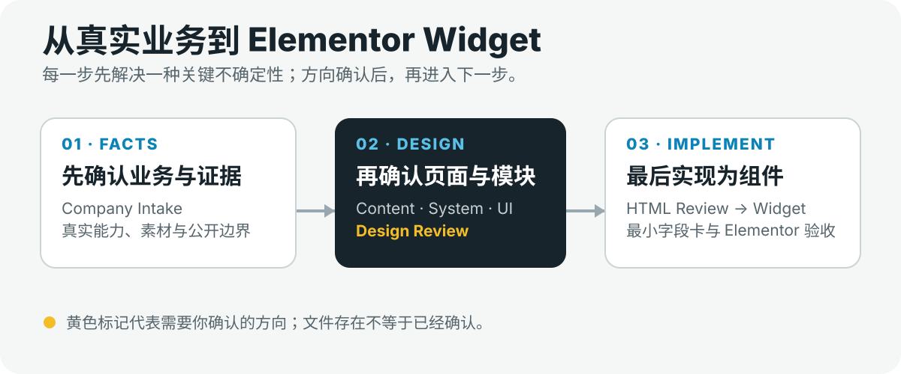

<p align="center">
  
</p>

# 🧩 Elementor Site Skills

> 用 AI 规划、设计并高还原实现可维护的 Elementor 自定义组件，完成一套可信的 B2B 企业站。

## 🖼️ 先看看它最终能做成什么

下面这个 B2B 首页不是从模板直接套出来的，而是经过内容、Design System、Architecture Map、视觉方向和 HTML Review 一步步完成的。

<p align="center">
  <a href="./assets/readme/homepage-demo.mp4">
    
  </a>
</p>

<p align="center"><strong>点击图片查看约 20 秒完整页面录屏</strong></p>

它的终点也不只是设计稿或 HTML。确认后的模块会沉淀为 Elementor 自定义 Widget：可以在组件面板中搜索和插入，也只开放真正需要编辑的字段。

<p align="center">
  <a href="./assets/readme/Elementor-widget.png">
    
  </a>
</p>

<details>
<summary><strong>查看完整长页面与 Widget 编辑效果</strong></summary>

<br>



<br><br>



</details>

## 👋 Hi，我是 Javen

我目前在一家 头部CNC 公司 RapidDirect 做外贸运营。工作中经常需要参与网站页面的策划和制作，这让我开始接触 AI 建站，也一路摸索出一些从网页设计到 Elementor 组件落地的方法。

我把这些真实项目中的心得和体验整理成这个仓库，希望能帮你更高效地使用 AI 做网站，少踩一些设计还原、组件复用和后期维护上的坑。如果你在使用过程中有任何想法、问题或改进建议，也欢迎告诉我；我会认真阅读，并持续把这套 Skills 打磨得更好。

我把自己在 B2B 企业站里反复使用的一套做法整理成了这组 Skills。它会陪你从业务事实、页面内容、Design System、UI 构图一路走到真实 HTML 和 Elementor 实现，把已经确认的网页设计沉淀成可复用、可维护的自定义 Widget。

> 我的原则很简单：让 AI 多做产出和自检；真正影响业务与设计方向的决定，始终留给你确认。

## 🎯 适合谁

如果你刚起步，希望用 Elementor 做一个专业的企业官网，这套流程就是为你准备的。无论你是设计师、运营，还是刚开始接触 Elementor 的外贸从业者，都可以从这里开始。

Elementor 很适合入门，但仅靠拖拽组件，往往很难稳定还原设计稿；而把一整段 HTML 直接塞进页面，短期虽然快，后面却不容易编辑、复用和维护。我希望用这套工作流，帮你避开这两个常见的坑。

## ✨ 能帮助你完成什么

你不只是得到一组 Widget 模板，而是拥有一条从项目初始化、内容与视觉梳理，到自定义 Elementor Widget 落地的完整路径。跟着它走，你可以：

- 先把整个网站的视觉方向和可执行的 Design System 定下来；
- 基于真实业务、证据与客户决策路径，规划一个可靠、可信的 B2B 企业站；
- 借助 `website-ui-architect` 设计整页和每个模块，确认后再进入实现；
- 高还原地将设计变为 Elementor 自定义 Widget，而不是把一次性 HTML 散落在页面中；
- 只开放真正需要编辑的字段，让编辑灵活性、设计一致性和长期维护性兼得。

## 💡 这套做法的优势

- **你有一条完整的路可以走**：项目初始化、内容、视觉、页面设计到 Widget 实现彼此衔接，不必在设计和开发之间来回断档。
- **先把设计想明白，再做组件**：我会先帮你确认页面与模块要承担的任务、信息结构和视觉方向，再把最终 HTML 做成组件，避免为了组件而牺牲设计。
- **尽量还原，也照顾后续维护**：组件以确认后的设计为实现源，同时只保留必要的编辑字段，避免传统 HTML 小工具难复用、难维护。
- **更贴近可信的 B2B 表达**：业务主张、证据和真实素材确认后才进入设计，能减少企业站出现虚构能力、案例或承诺的风险。
- **人和 AI 各做擅长的事**：AI 帮你生成、自查和整理；业务取舍、品牌气质和设计方向这些关键判断，仍由你来拍板。

## 🏢 B2B 是主场景，也可迁移参考

我最初是为 B2B 企业官网做这套 Skills 的：这类网站通常有更复杂的业务信息、更长的决策链路，也更需要可信的证据和专业表达。这里的“设计好”，不只是页面够不够新颖、够不够有风格，更是让目标客户能否看懂你做什么、相信你有能力做到，并愿意询价。

我看到的许多公开 UI Skills，更擅长帮助你快速探索 SaaS、个人网站或 B2C 品牌站的视觉方向。这些方法很有价值；只是到了 B2B，不能只从“这个模块好不好看”出发，而要先问：它在当前页面里承担什么商业任务？该用什么真实证据支撑？它是否让客户的疑问更少、信任更多？

所以在这套流程中，我会特别关注：

- **先确定页面要传递什么**：从客户的决策路径出发，而不是先挑一个流行版式；
- **再判断每个模块为何存在**：它是解释、证明、比较、引导，还是促成咨询；
- **让证据成为设计的一部分**：真实的产品、工厂、设备、文件、数据与案例，比装饰性的图标或口号更有说服力；
- **让视觉重量跟着信息重要性走**：核心证明值得更多空间，辅助 CTA 则保持清楚、克制，不让整页每个模块都在抢注意力。

我还没有看到一套公开工作流，像这样把这些 B2B 设计判断、页面与模块还原，以及最终的 Elementor Widget 实现串成一条完整路径；这也是我想把它整理并分享出来的原因。

如果你在做通用 B2C 网站、作品集、活动页或其他类型网站，内容梳理、视觉系统、模块审查和组件化的方法同样也值得参考。

## 🔄 不只适用于 Elementor

这个仓库的最终落地示例是 **WordPress + Elementor 自定义 Widget**，但前面的设计方法并不被 Elementor 限制。如果你在 WordPress 中使用 ACF、原生区块（Gutenberg）或其他自定义主题方案，或使用 Next.js、Astro、React、其他前端框架和 CMS 后台，也可以直接借鉴其中的网站内容、Design System 和 `website-ui-architect` 的页面与模块设计方法。

换句话说，**先把网站设计和模块还原的判断做好，再选择适合你项目的技术实现方式**。在这个仓库里，我用 Elementor 来实践；在你的项目里，你可以用任何合适的技术栈，把确认后的设计落地。

## 🧠 我为什么把流程拆成这样

 AI 可以很快做出一个“看起来完整”的网页，同时AI也会把未经确认的判断一路被带进代码，导致设计的页面“AI味“太强，通常有以下原因：

- 业务资料不足时虚构能力、认证、案例或承诺；
- 从条目数量直接推导卡片网格；
- 产品、设备与证书被通用图标或小缩略图替代；
- 单个模块看起来精致，整页却重复 KPI、Logo、双栏和 CTA；
- 方向图中的错误布局被 HTML 忠实复刻；
- 为了后台可编辑，给 Widget 增加过多字段并破坏确认设计。

所以我做这套 Skills，不是想让 AI 更大胆地生成，而是希望把高成本错误提前暴露、提前修正。

## 🗺️ 跟着它怎么走

<p align="center">
  
</p>

做一个完整页面时，核心链路是：

```text
Confirmed Page Content + Active Baseline Design System
→ Page UI Architecture Map
→ Module Design Review + 用户确认
→ Overview + 分段视觉方向稿
→ Visual Direction Review（A / B / C 分流）
→ 整页优先或逐模块优先 HTML
→ HTML Design Review
→ Browser / Implementation QA
→ Elementor Widget Pipeline
```

## 🧭 你会用到的 1 个总控和 5 个专项 Skills

| Skill | 角色 | 解决的问题 | 主要产物 |
| --- | --- | --- | --- |
| `elementor-site-team-manager` | 项目经理 / 总控 | 当前在哪个阶段，下一步由谁处理？ | 路由、门禁、工作流状态 |
| `elementor-site-initialize` | 工程初始化 | Widget 应进入什么插件结构？ | 项目配置、Flat / Grouped 插件骨架 |
| `website-page-content-architect` | 内容架构 | 页面为谁服务、先说什么、需要什么证据？ | UI-ready Page Content Framework |
| `website-design-system-architect` | 视觉系统 | 整个网站应使用什么视觉语言？ | Design Board、Active Baseline Design System |
| `website-ui-architect` | 页面与模块设计 | 每个 Section 如何表达，整页是否成立？ | Architecture Map、方向稿、HTML、Module Slug |
| `elementor-widget-pipeline` | Elementor 实现 | 哪些内容可编辑，如何稳定实现？ | 字段卡、PHP、CSS、可选 JS、验证结果 |

> `Company Intake` 是总控里轻量的事实收集步骤，不是第七个独立 Skill。

## 🛡️ 我会特别帮你守住的几件事

### 1. 先把事实说清楚，再设计页面

我会优先看公司事实、业务边界、真实素材和证据，而不是拿行业惯例替代它们。没有依据时，我们可以先规划要补什么素材，但不会编造访客能看到的认证、客户、产能或案例。

### 2. 内容和视觉，各自先确认好

Page Content 负责“说什么、先说什么”，Design System 负责“全站用什么视觉语言”。这两件事确认后，`website-ui-architect` 再来处理页面构图，过程会稳很多。

### 3. 生图前，先聊清楚模块方案

Architecture Map 不只是布局清单。我会陪你从下面四层看每个 Section：

- **Commercial Job**：模块承担什么商业任务；
- **Evidence Structure**：主张由什么证据支持；
- **Information Geometry**：Layout 是否匹配真实信息关系；
- **Page Context**：与前后模块是否重复或争抢焦点。

### 4. 方向稿够你判断，就可以往下走

方向稿不需要当成设计师终稿。它只要能让你判断构图、证据主次、大致比例、密度、留白和节奏就够了；精确比例、换行、间距和裁切交给 HTML，没必要为了接近 `16:9` 或 `4:3` 反复生图。

### 5. 每一步都知道何时该停下来确认

明确的问题，我最多自动修正一轮；涉及业务取舍、品牌气质或多个合理 Layout 时，会请你来决定。文件存在不等于已确认；你接受当前方向后，也不会为了“更完美”反复把已经通过的步骤打开。

## 🚀 你可以这样开始

> **第一次使用？直接从 `elementor-site-team-manager` 开始，不需要记住其他 Skill。**

通常你只要调用总控，不需要手动记住每个专项 Skill：

```text
使用 elementor-site-team-manager，帮助我从当前项目状态继续完成这个 B2B 企业站。

公司资料位于：<path>
计划页面：<pages>
目标：完成页面设计，并将确认模块实现为 Elementor 自定义 Widget。

请不要重做已经确认的内容；每到需要我决定的门禁时，给出简短说明和推荐意见。
```

总控会先看看你已经完成了什么、哪些方向已经确认，再带你进入当前真正需要的下一步。

## 🛣️ HTML 阶段，你可以选两条路

### 整页优先

如果方向已经成熟、模块关系也清楚，或者你想尽快看到完整页面，可以先完成整页 HTML Review，再从边界清楚的 Section 进入 Widget Pipeline。

### 逐模块优先

如果页面比较复杂、局部方向还想慢慢确认，或者模块需要跨页面复用，可以一次只设计、审查和实现一个模块，最后再拼成整页。

两条路可以切换；只是进入 Pipeline 前，我们要先确认当前 Widget 最终以哪份 HTML 为实现源。

## ✅ 每一步先确认什么

| 阶段 | 进入下一步前必须确认 |
| --- | --- |
| Company Intake | 公司是谁、提供什么、服务谁，以及不能公开使用的主张 |
| Page Content | 页面任务、Section 顺序、真实文案和素材需求 |
| Design System | 单一 Design Board 与 Active Baseline |
| UI Architecture | 完整页面的 Architecture Map |
| Visual Direction | Overview 与必要分段稿足以指导 HTML |
| HTML | HTML Design Review 与 Browser QA 已完成 |
| Widget | Canonical Module Slug、最终实现源和最小字段卡 |

## 📁 过程中会沉淀下来的文件

```text
docs/
├── company/about-company.md
├── page-content/<page-slug>.md
├── design-system/design-system.md
└── workflow-status.md

设计稿/
├── design-system/style-board.html
├── directions/<page-slug>/
├── pages/<page-slug>.html
└── modules/<module-slug>.html
```

Elementor 插件会采用 `Flat` 或 `Grouped` 结构，我会根据预计 Widget 数量和业务分组来建议你选择；确认后，不会在后续实现时悄悄迁移结构。

## 🚧 这套 Skills 暂时不替你做的事

- 不替你安装 Elementor、搭建 WordPress 环境，或自动寻找站点根目录；
- 不把主题开发、生产发布和缓存清理混进 Widget Pipeline；
- 不用生成图冒充真实工厂、设备、客户、证书或案例；
- 不会默认把颜色、字体、间距、圆角和动画全部开放成 Elementor Style Controls；
- 不会因为整页 HTML 已完成，就批量生成所有 Widget；
- 最终页面仍需要你在真实 Elementor 环境中组装并验收。

## 📚 如果你想再多了解一点

前面的说明偏文字和方法。如果你更喜欢用图文快速理解，我也把两组内容整理成了可顺序浏览的信息卡：一组聊 AI 如何更好地参与网站设计，另一组聊我对 AI 时代个人成长的长期思考。

- [AI 辅助网站设计：从“模板味”到设计判断](./复盘反思/AI辅助网站设计/)
- [AI 时代个人心态：普通人到底该卷什么](./复盘反思/AI时代个人心态/)
- [完整使用说明与设计复盘](./复盘反思/Elementor自定义组件建站Skills使用说明与设计复盘.md)
- [B2B 网站模块设计判断框架](./复盘反思/B2B网站模块设计判断框架.md)
- [从隐性经验到可用 Skill 的复盘](./复盘反思/从隐性经验到可用Skill的复盘.md)
