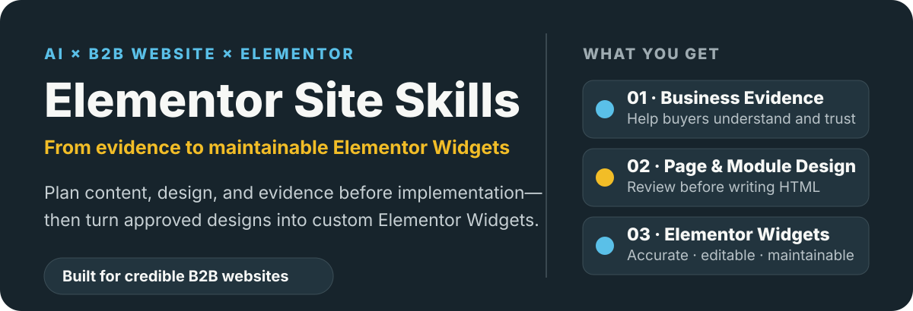
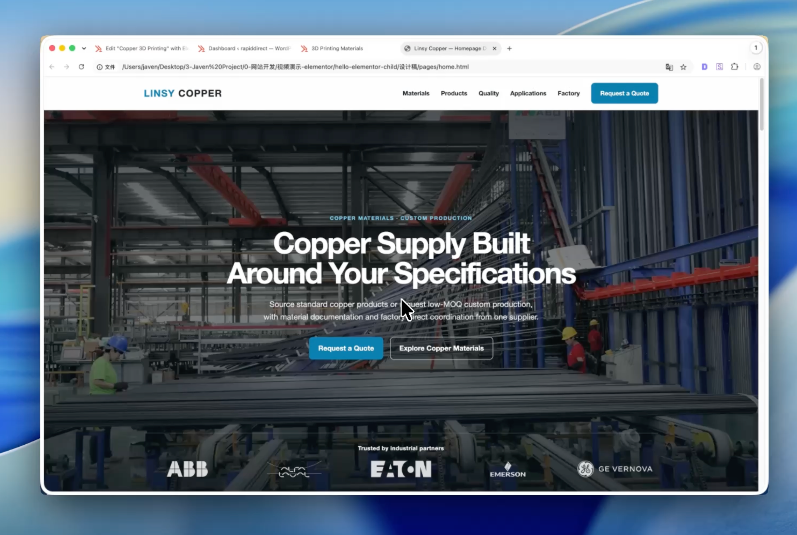
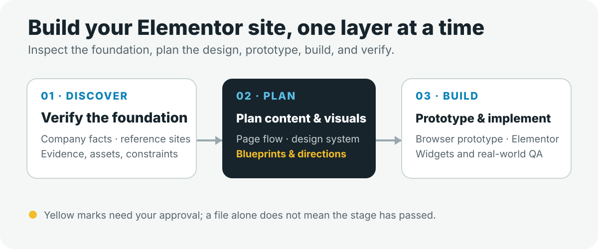

<p align="right"><a href="./README.md">简体中文</a> · <strong>English</strong></p>

<p align="center">
  
</p>

# 🧩 Elementor Site Skills

> A layered, AI-assisted workflow for real B2B website projects: verify company facts, plan the page and visual system, prototype in the browser, and turn approved modules into maintainable custom Elementor Widgets.

This is not a “one prompt, one finished website” template pack. It is a team of **one coordinator and eight specialist Skills**. Together, they route each project to the stage it actually needs and keep business decisions, design approval, implementation, and QA in the right places.

## 🖼️ See the outcome first

The B2B homepage below was not assembled from a generic template. The workflow verified the business and source materials, planned the content, established a visual system, reviewed the page direction, and only then moved into browser and Elementor implementation.

<p align="center">
  <a href="https://github.com/javen-wangjunren/elementor-website-skill/releases/download/v0.1.0/homepage-demo.mp4">
    
  </a>
</p>

<p align="center"><strong>Click the image to download the 20-second page walkthrough</strong></p>

The result is not just a mockup or browser-ready HTML. Approved modules become custom Elementor Widgets that can be searched and inserted from the Elementor panel, while exposing only the fields editors genuinely need.

<p align="center">
  <a href="./assets/readme/Elementor-widget.png">
    
  </a>
</p>

<details>
<summary><strong>View the full page and Widget editing experience</strong></summary>

<br>


<br><br>


</details>

## 🚀 From a local workspace to WordPress

This repository is not a universal Widget plugin that you install immediately after downloading. It is an AI website team that works on **your current website project**: clarify the content and design locally, build a browser-ready prototype, and then package approved modules as an installable WordPress plugin.

The shortest path is:

1. Download or clone this repository, then copy the nine Skill folders at the repository root into `~/.agents/skills/elementor/`.
2. Create a local project workspace such as `my-b2b-site/`. It does not need to be your WordPress root.
3. Invoke `elementor-site-team-manager` and provide your company materials, planned pages, and goal. It will decide whether the project needs research, content, visual direction, HTML prototyping, or Widget implementation next.
4. When the first custom Widget is needed, `elementor-site-initialize` creates the plugin skeleton at a path you approve. Before Elementor implementation, the workflow can also translate the visual system into site-wide color, typography, and spacing guidance.
5. After the Widgets are built and verified locally, copy the **complete plugin folder** into WordPress `wp-content/plugins/`, or compress that plugin folder as a ZIP and upload it through **Plugins → Add New Plugin → Upload Plugin**.

> Compress only the generated plugin folder—not the entire workspace, design files, or `docs/`. The target WordPress site must already have Elementor installed.

Start with a prompt like this:

```text
Use elementor-site-team-manager to help me complete a B2B website from the current project state.

Company materials: <path>
Planned pages: <pages>
Local project workspace: <local-project-path>
Goal: complete the page design and turn approved modules into a maintainable custom Elementor Widget plugin.
```

## 👋 Hi, I’m Javen

I manage website operations at RapidDirect, a CNC manufacturing company, and I am closely involved in page planning and production. The site currently receives more than 100,000 monthly organic clicks from Google Search and has a Domain Rating of around 70. I started exploring AI-assisted website building earlier this year and have since developed a practical workflow from page design to Elementor Widget implementation.

These Skills capture methods I have repeatedly used in real B2B website projects. They move from company facts, page planning, and visual direction to browser-ready pages and Elementor Widgets, turning approved designs into reusable, maintainable website assets.

I hope this repository helps you work with AI more effectively and avoid common problems in design fidelity, component reuse, and long-term maintenance. Suggestions, questions, and improvements are always welcome—I read them carefully and will keep refining the workflow.

> My principle is simple: let AI do more production and self-checking, while keeping the business and design decisions that matter in human hands.

## 🎯 Who this is for

These Skills are for marketers, designers, and international sales teams that want to build professional business websites with Elementor. They are not fixed Widget templates, and they do not replace professional designers. Instead, they standardize the content, design, development, and validation work that often depends on undocumented personal experience.

- **General B2B and export teams:** use fact checking, page outlines, visual rules, design reviews, and real browser validation to produce a credible, conversion-ready, maintainable website.
- **Professional designers:** join at the design-system, visual-direction, or design-review stage and focus on the hero, key visuals, typography, and motion that raise the brand ceiling.

As a rough analogy, the workflow aims to stabilize the design and implementation baseline around **70–80%**, while professional designers can push the brand and visual quality beyond **90%**. This describes the intended role of the workflow; it is not a universal score or performance guarantee.

## ✨ What it helps solve

- Plan pages around real business facts, evidence, and buyer decisions without inventing capabilities, clients, or case studies.
- Research three to five approved reference sites when useful, borrowing methods without copying brands or assets.
- Confirm what the page should say, how it should look, and how each module should work before development begins.
- Keep motion restrained by default: add it only when it improves comprehension, feedback, or brand expression—not simply to make every section fade in.
- Translate the visual system into Elementor-friendly color, typography, and spacing guidance, then turn approved designs into Widgets with only the necessary editable fields.
- Fix problems at their source: content problems in content, visual-system problems in the design system, layout problems in page design, and rendering problems in code.

## 🏢 Why the workflow starts with B2B

B2B websites carry complex business information and support longer buying journeys. “Good design” is therefore not just visual novelty. Buyers need to understand what you do, believe that you can deliver it, and feel confident enough to enquire. Page order, module purpose, evidence, and visual emphasis all need to support that decision.

The final implementation in this repository uses **WordPress + custom Elementor Widgets**, but the methods for page planning, visual systems, design review, and root-cause rework can also be applied to Gutenberg, ACF, Next.js, Astro, React, or another CMS. The principle remains the same: **make the decisions well before choosing the implementation.**

AI can generate a complete-looking page quickly, but it can also carry unverified assumptions all the way into code. This layered workflow establishes clear sources of truth across facts, content, visual systems, page design, and implementation so expensive mistakes appear earlier and can be corrected within a smaller scope.

## ✨ Motion is a finishing touch, not a requirement

A B2B website should remain complete, clear, and credible without motion. Basic feedback for buttons, links, tabs, accordions, and menus is the default. Viewport reveals are added only when content has a meaningful sequence or hierarchy. Scroll-linked, sticky, or multi-stage scenes are rare brand-level enhancements, usually considered only for a homepage, a brand-led About page, a campaign page, or a core page that explains a complex process.

- **Layer 1 / Basic feedback:** interaction states for buttons, links, menus, tabs, and accordions, implemented with CSS and small amounts of native JavaScript.
- **Layer 2 / Content reveal:** used only when hierarchy or sequence matters, with CSS, IntersectionObserver, or the Web Animations API as needed.
- **Layer 3 / Brand scenes:** redesign and approve the module first; evaluate GSAP only when native implementation is not enough for a justified timeline or scroll-linked interaction.

Core content must remain visible without JavaScript and when reduced motion is enabled. Ordinary modules do not receive runtime-library controls and do not automatically load GSAP, Motion, or another animation dependency.

To review an existing page, try:

```text
Review this approved HTML page and identify any modules where motion would genuinely improve a B2B experience.
Do not modify the code yet. Explain whether each recommendation belongs to Layer 1, Layer 2, or Layer 3 and why it is needed.
```

## 🗺️ How the workflow moves

<p align="center">
  
</p>

Think of the workflow like constructing a building: inspect the foundation, prepare the plans, approve the direction, build a prototype, and only then begin production. The coordinator does not force every task to start at step one; it continues from the earliest stage the current project actually needs.

```text
Verify company facts and real assets
→ Research 3–5 reference websites when needed
→ Plan what the page says, in what order, and with what evidence
→ Establish site-wide color, typography, spacing, visual tone, and motion principles
→ Map every module, its commercial job, and any justified motion intent
→ Review and approve the visual direction
→ Build a browser-ready HTML prototype
→ Implement one Elementor Widget at a time
→ Assemble and verify the page in a real Elementor environment
```

## 🧭 How the AI website team is divided

You do not need to memorize these names. Think of them as a project team: the coordinator evaluates progress, while each specialist Skill owns one class of work.

| Skill | Role | In plain English |
| --- | --- | --- |
| `elementor-site-team-manager` | Project coordinator | Reads the project state and routes the next task to the right specialist |
| `elementor-site-initialize` | Workspace manager | Creates the project structure and plugin skeleton |
| `website-reference-researcher` | Reference researcher | Studies useful websites for patterns without copying their brand or content |
| `website-page-content-architect` | Page strategist | Defines the audience, message, evidence, and content order |
| `website-design-system-architect` | Design-system architect | Establishes shared color, typography, spacing, visual tone, and motion principles |
| `elementor-site-style-adapter` | Platform translator | Maps the visual system into Elementor-compatible site-style guidance |
| `website-ui-architect` | Page designer | Maps the page and modules, produces visual directions, and identifies justified motion intent |
| `website-html-prototyper` | Prototype builder | Turns approved design and motion into browser-ready, testable interactive HTML |
| `elementor-widget-pipeline` | Widget engineer | Turns approved modules into editable, maintainable Elementor Widgets |

> The coordinator also performs a lightweight Company Intake when source material is incomplete. Reference research is optional and runs only when it can answer a real design question.

## 🛡️ What the workflow protects

- **Facts before design:** document evidence gaps instead of inventing certifications, clients, capacity, or case studies.
- **Separate content and visual approval:** decide what the page says before deciding how the whole site looks.
- **Structure before direction:** review module purpose, evidence, and page sequence before generating visual directions.
- **Directions support decisions:** approve composition, hierarchy, density, and rhythm; leave exact line breaks, spacing, and cropping to HTML.
- **Motion needs a purpose:** keep feedback lightweight, add content reveals selectively, and approve brand-level scenes separately.
- **Automate implementation fixes, pause for human judgment:** let each Skill correct issues within its authority, but stop for business trade-offs and brand decisions.

## 🚀 Start here

> **First time using the repository? Start with `elementor-site-team-manager`; you do not need to memorize the other Skills.**

```text
Use elementor-site-team-manager to help me continue this B2B website from its current project state.

Company materials: <path>
Planned pages: <pages>
Goal: complete the page design and turn approved modules into Elementor Widgets.

Do not redo approved work. At every decision gate, give me a short explanation and a recommended option.
```

The coordinator checks what already exists and what has been approved, then takes you to the next stage that genuinely needs work.

## 🛣️ Two ways to build the browser prototype

The HTML page is the furnished model room before production: it lets you inspect desktop and mobile behavior in a real browser and gives the Elementor implementation a reliable source.

### Full page first

When the direction and module relationships are mature, build the complete HTML page first, then move clearly bounded sections into the Elementor Widget pipeline.

### Module first

When the page is complex or individual modules need deeper iteration and cross-page reuse, prototype one module at a time and combine them after approval.

You can switch between the two routes. Before Widget implementation begins, confirm which approved prototype is the source of truth.

## ✅ What you approve at each stage

| Stage | Approval required |
| --- | --- |
| Company Intake | What the company does, who it serves, and which claims and assets may be used publicly |
| Reference Research | Which sites to study and the rule that patterns—not brands or content—may be reused |
| Page Content | Page objective, content order, real copy, and required assets |
| Design System | Color, typography, spacing, visual tone, and baseline motion principles |
| Page Architecture | Where each module belongs, what job it performs, and whether motion is justified |
| Visual Direction | Composition, hierarchy, density, and overall rhythm |
| Browser Prototype | Whether desktop and mobile behavior match the approved direction |
| Elementor Widget | Which fields editors need and which approved design is authoritative |

## 📁 Artifacts produced along the way

These files act as project records, plans, and QA evidence. The coordinator maintains most of them, so first-time users do not need to understand every file before starting.

```text
docs/
├── company/about-company.md
├── research/<scope>-visual-reference-brief.md
├── page-content/<page-slug>.md
├── design-system/design-system.md
├── elementor/elementor-style-contract.md
└── workflow-status.md

elementor-project.json

设计稿/                              # Design artifacts
├── design-system/style-board.html
├── directions/<page-slug>/
├── pages/<page-slug>.html
└── modules/<module-slug>.html

<approved-plugin-path>/
└── <plugin-slug>/                 # Copy or compress this folder for WordPress
```

The Elementor plugin can use a `Flat` structure or group Widgets by business area (`Grouped`). `elementor-site-initialize` recommends a structure based on the expected number of Widgets; later stages do not silently change that choice.

## 🚧 What these Skills do not do

- They do not install Elementor, provision WordPress, or search for your site root automatically.
- They do not mix theme development, production deployment, or cache operations into Widget implementation.
- They do not use generated images as fake factories, equipment, clients, certificates, or case studies.
- They do not expose every color, font, spacing, radius, or animation value as an editor control by default.
- They do not generate every Widget in bulk simply because a full-page prototype exists.
- They do not copy a reference website’s brand, assets, or business facts into your project.
- They do not directly change Elementor Global Colors, Fonts, or spacing; the style adapter first produces a local implementation contract.
- Final pages still need to be assembled and verified in a real Elementor environment.

## 📚 Further reading

The following project notes are currently available in Chinese:

- [How an AI + WordPress production system differs from one-prompt website generation](./复盘反思/AI-WordPress网站生产体系与一句话生成的区别.md)
- [A layered design-system approach](./复盘反思/layered-design-system.md)
- [Full usage guide and design retrospective](./复盘反思/Elementor自定义组件建站Skills使用说明与设计复盘.md)
- [A framework for evaluating B2B website modules](./复盘反思/B2B网站模块设计判断框架.md)
- [From tacit experience to usable Skills](./复盘反思/从隐性经验到可用Skill的复盘.md)

## License

Released under the [MIT License](./LICENSE).
